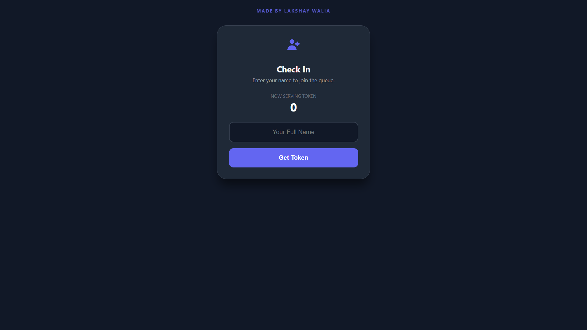
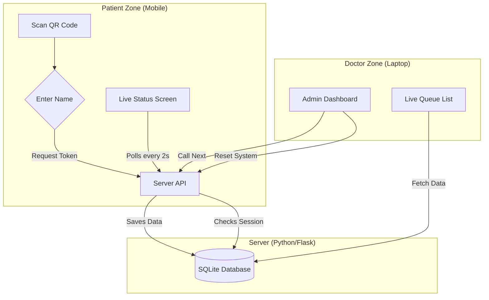
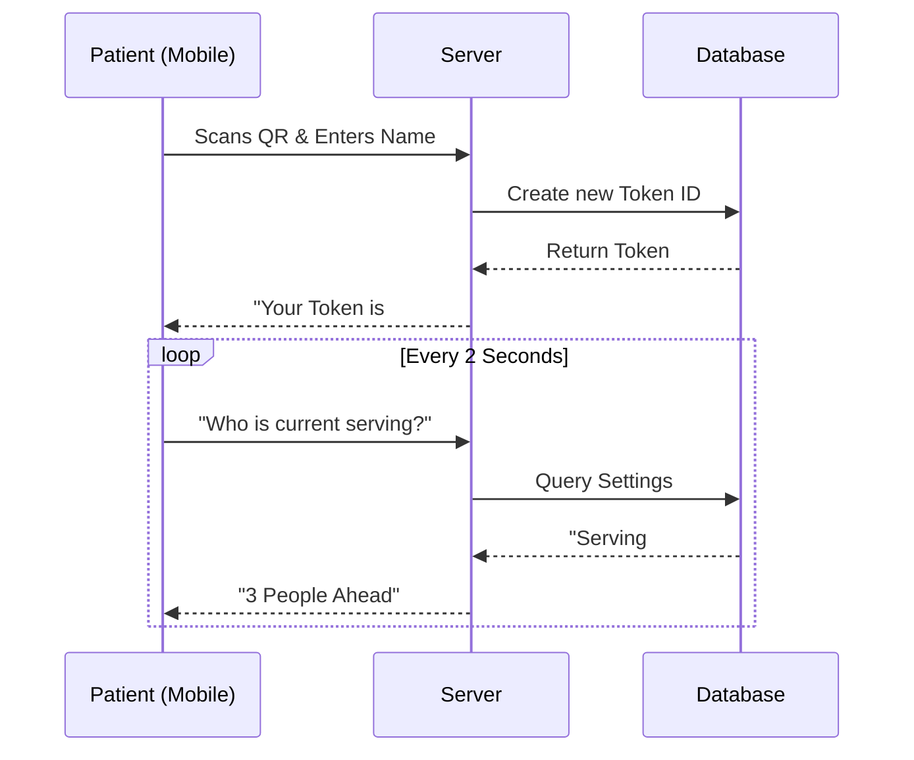

# 🏥 Smart Clinic Queue System (Offline/Online)

**Developed by:** Lakshay Walia  
**Tech Stack:** Python (Flask), SQLite, HTML5, CSS3 (Dark Mode), JavaScript

  

## 📖 Overview
This is a **Queue Management System (QMS)** designed for clinics and hospitals. It allows patients to book appointments via their own mobile devices by scanning a QR code, eliminating the need for physical queues. 

The system operates in real-time, providing live updates on wait times and "Current Token" status. It features a robust **Doctor Dashboard** for queue control and an **auto-reset safety mechanism**.

---

## 📸 Interface Previews

| **👨‍⚕️ Doctor Dashboard** | **📱 Patient Mobile View** |
|:---:|:---:|
|  |  |
| *Controls the queue & resets sessions* | *Live status updates & booking* |

---

## ⚡ Key Features
* **📱 Contactless Booking:** Patients scan a QR code to join the queue.
* **🌗 Dark Mode UI:** Professional, eye-strain-free interface for both doctors and patients.
* **🔄 Auto-Reset Protection:** If the doctor resets the queue, patient devices automatically detect the new session and reset their local status.
* **📡 Hybrid Connectivity:** Works fully **Offline** (Local Wi-Fi) or **Online** (Cloud Hosted).
* **💾 Persistent Database:** Uses SQLite to save queue data even if the system restarts.
* **🔔 Live Status Updates:** Patients see "People ahead of you" and get a green pulse animation when it's their turn.

---

## 🛠️ System Architecture



---

## 🔄 User Flowcharts

### 1. Patient Booking Flow


### 2. Doctor Management Flow
```mermaid
flowchart LR
    A[Doctor Dashboard] --> B{Action?}
    B -->|Click 'Next'| C[Update Database (+1)]
    B -->|Click 'Reset'| D[Clear Patients Table]
    D --> E[Generate New Session ID]
    C --> F[Update Patient Screens]
    E --> G[Force Reset All Phones]
```

---

## 🚀 Installation & Usage

### Prerequisites
* Python 3.x installed
* VS Code (Optional)

### Step 1: Install Dependencies
```bash
pip install flask qrcode
```

### Step 2: Run the Application
```bash
python clinic_offline.py
```
* This will automatically generate a `clinic_qr.png` file.
* The **Doctor Dashboard** will open automatically in your browser.

### Step 3: Connect Patients
1.  Ensure the Doctor's Laptop and Patient Phones are on the **same Wi-Fi network**.
2.  Open the `clinic_qr.png` image on the laptop.
3.  Scan it with any phone to book a token.

---

## 📂 Project Structure
```text
CLINIC_PROJECT/
├── clinic_offline.py       # Main Application Logic (Flask Server)
├── clinic_demo.db          # SQLite Database (Auto-created)
├── clinic_qr.png           # Generated QR Code (Auto-created)
├── doctor_ui.png           # Screenshot (Added manually)
├── patient_ui.png          # Screenshot (Added manually)
└── README.md               # Documentation
```

---

**© 2025 Lakshay Walia** | All Rights Reserved.